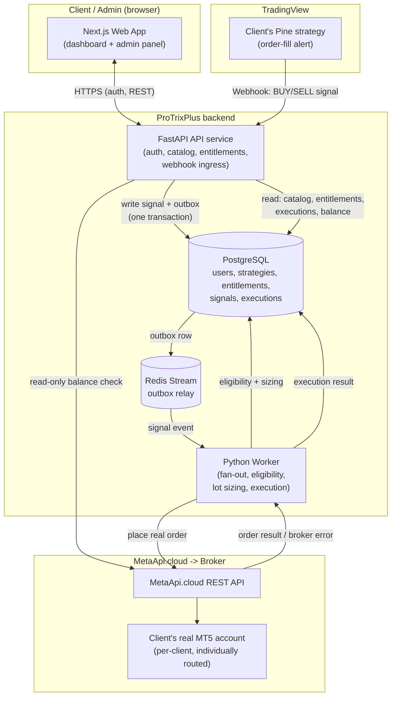
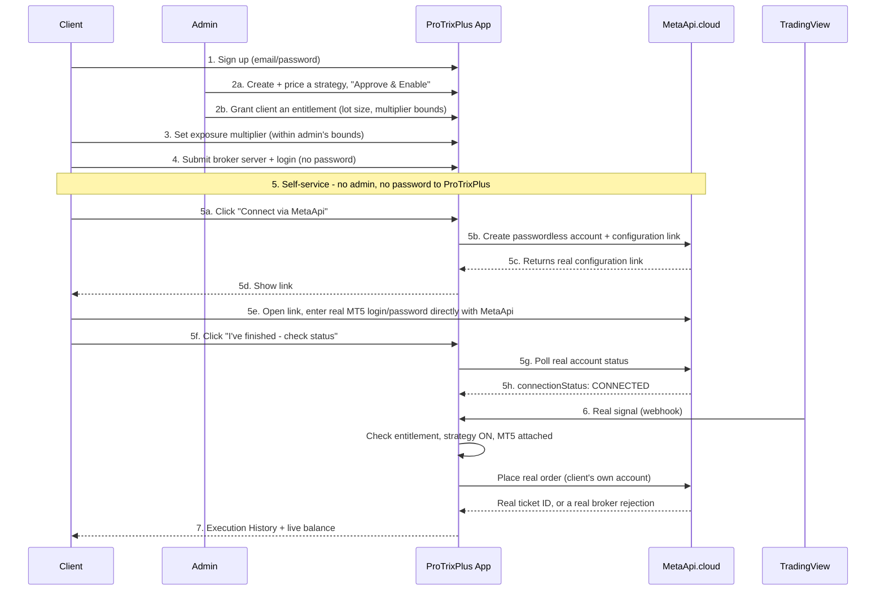

# ProTrixPlus — System Architecture & New-Client Onboarding Flow

This document covers two things: (1) the overall system architecture as it's
actually built and running today, and (2) the step-by-step flow a new client
goes through. Nothing below is aspirational — every component and step
described is real and deployed, and the one remaining gap is called out
explicitly rather than glossed over.

## 1. System architecture

**Key real design facts:**
- Every client's signal is routed to **their own** MetaApi account — never a shared one (per-user `Mt5Connection.metaapi_account_id`).
- The worker computes lot size and checks entitlement *before* ever calling MetaApi — MetaApi is transport only, never a decision-maker (ADR-001).
- A signal is durably written to Postgres *before* it's acknowledged — nothing is lost if the worker is down when a signal arrives.

## 2. New-client onboarding — sequence

## 3. Step-by-step detail

| # | Step | Who | Self-service? |
|---|------|-----|----------------|
| 1 | Sign up (email, password, display name) | Client | ✅ Yes |
| 2a | Create/price/approve a strategy in the catalog | Admin | — (admin-only by design) |
| 2b | Grant the client an entitlement (base lot, multiplier bounds) | Admin | ❌ No payment gateway yet — admin grants after being paid out-of-band |
| 3 | Client picks their exposure multiplier within the admin's bounds, with a live real lot-size preview | Client | ✅ Yes |
| 4 | Client submits their broker server + MT5 login number | Client | ✅ Yes (no password field — nothing is stored) |
| 5 | Client clicks "Connect via MetaApi", ProTrixPlus creates a passwordless MetaApi account and returns a real configuration link; the client opens it and enters their real MT5 password directly on MetaApi's own page — ProTrixPlus and any admin never see it | Client | ✅ Yes — self-service, no admin involved |
| 6 | A real TradingView alert fires → webhook → entitlement + connection checked → real order placed on the client's own MetaApi-routed account | System (automatic) | ✅ Fully automatic once 1–5 are done |
| 7 | Client sees real balance/equity (tagged `LIVE`), and every order attempt in Execution History with a plain-English + technical reason if rejected | Client | ✅ Yes |

## 4. Known gaps (not hidden, not yet built)

1. **No payment gateway.** Entitlement is admin-granted, trusting that payment happened outside the app. Scoped for a later phase.
2. **Management actions (closing/modifying an existing position from a TradingView alert) aren't supported yet** — every alert is currently treated as a fresh entry. This mirrors a limitation of the underlying `position_ref` design, not something specific to onboarding.

MetaApi onboarding (step 5) used to be a manual gap — an admin had to handle the client's real MT5 password by hand. That's now resolved: the client generates their own configuration link from the app and enters their password directly with MetaApi. An admin can still attach an existing MetaApi account ID by hand as a fallback/override, but it's no longer required for a new client.
