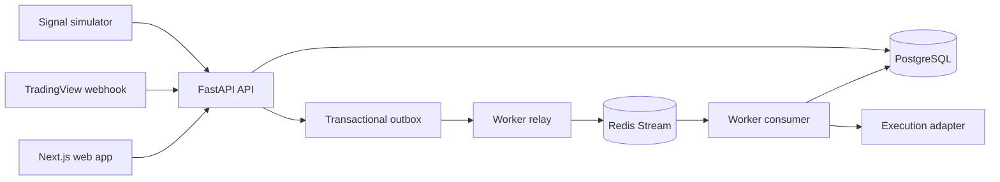

# ProTrixPlus Technical Documentation

## 1. Purpose

ProTrixPlus is a trading-signal bridge. It accepts a versioned trading signal,
stores it durably, distributes it to eligible users, creates order intents, and
drives those intents through an execution lifecycle.

The current milestone is **S0**. It is a local development foundation, not a
live trading platform. TradingView, identity, credential storage, and broker
execution are represented by local mocks or interfaces.

## 2. System Context



### Services

| Service | Technology | Responsibility |
| --- | --- | --- |
| `web` | Next.js 14 | Login, user dashboard, admin dashboard |
| `api` | FastAPI | Webhook ingress, validation, persistence, read APIs, mock identity |
| `worker` | Python | Outbox relay, stream consumption, fan-out, execution lifecycle |
| `postgres` | PostgreSQL 16 | Durable source of truth |
| `redis` | Redis Streams | Worker transport and recovery queue |

The local stack is defined in [infra/docker-compose.yml](../infra/docker-compose.yml).

## 3. Repository Structure

| Directory | Purpose |
| --- | --- |
| `contracts/` | Shared webhook schema, hashing, lifecycle rules, money helpers, and ORM models |
| `api/` | FastAPI application, migrations, authentication, webhook and read routers |
| `worker/` | Relay, consumer, fan-out, eligibility, sizing, adapters, and execution driver |
| `web/` | Next.js App Router frontend |
| `infra/` | Docker Compose configuration and signal simulator |
| `tests/` | Cross-service integration and end-to-end tests |
| `docs/` | Architecture, decisions, setup, and technical documentation |

The database models are deliberately shared from `contracts/`. This keeps the
API and worker aligned on table names, columns, constraints, and lifecycle
values.

## 4. End-to-End Example

Assume a strategy named `trend-rider` produces a BUY signal for EURUSD on a
15-minute chart.

### 4.1 Incoming webhook

The simulator sends a request equivalent to:

```http
POST /webhook/tradingview
Content-Type: application/json
X-Webhook-Token: dev-webhook-token-change-me
```

```json
{
  "schema_version": "1.0",
  "strategy_key": "trend-rider",
  "strategy_version": "2025.09",
  "signal_id": "signal-1001",
  "event_time_utc": "2026-09-14T09:00:00Z",
  "action": "BUY",
  "symbol": "EURUSD",
  "timeframe": "15m",
  "master_lot_info": {
    "master_lot": "1.00",
    "note": "informational only - not authoritative"
  },
  "stop_loss": "1.07500",
  "take_profit": "1.09000"
}
```

The API performs these steps in order:

1. Validate the body against the v1.0 contract.
2. Build an idempotency key from strategy, version, and signal ID.
3. Calculate a canonical SHA-256 payload hash.
4. Insert a `signals` row.
5. Insert a matching `outbox` row.
6. Commit both rows in one PostgreSQL transaction.
7. Return a successful response only after the commit.

A typical response is:

```json
{
  "accepted": true,
  "duplicate": false,
  "signal_id": "signal-1001",
  "signal_row_id": "...",
  "payload_hash": "sha256:..."
}
```

If validation fails, the API returns `422`. If webhook authentication fails,
it returns `401`.

### 4.2 Duplicate delivery

Webhook providers commonly retry requests. If `signal-1001` is delivered a
second time with the same body, the API returns success with:

```json
{
  "accepted": true,
  "duplicate": true,
  "signal_id": "signal-1001"
}
```

No second signal or outbox row is created. If the same ID arrives with a
different payload, the request is rejected as a conflict instead of silently
changing the original signal.

### 4.3 Outbox relay

The worker relay polls pending outbox rows. It locks rows with PostgreSQL row
locking, publishes the event to the Redis stream
`protrix.signals.v1`, and marks the outbox row as published.

PostgreSQL remains the durable record. Redis is only the transport layer, so a
worker or Redis restart does not erase the accepted signal.

### 4.4 Fan-out and order intent

The worker consumer reads the Redis stream through a consumer group. For the
example signal, it finds seeded active users and evaluates eligibility.

S0 eligibility is always active. For each eligible user, the worker creates one
`order_intent` identified by:

```text
(user, strategy, signal, command_target)
```

That combination has a database uniqueness constraint. Replayed Redis messages
therefore cannot create duplicate intents.

### 4.5 Execution

For each order intent, the worker creates an execution and advances it through:

```text
RECEIVED
  -> INTENT_CREATED
  -> QUEUED
  -> DISPATCHED
  -> ACKNOWLEDGED
  -> FILLED
```

The S0 `MockExecutionAdapter` returns deterministic ticket and deal IDs. The
dashboard then reads the persisted signal and execution records through the
API.

If the adapter times out after dispatch, the state becomes:

```text
DISPATCHED -> UNKNOWN -> RECONCILED -> FILLED or REJECTED
```

The worker calls `sync_positions()` while reconciling. It does not blindly call
`place()` again, preventing a duplicate trade after an uncertain broker result.

## 5. Data and Reliability Model

### Transactional outbox

The signal and its outbox event are committed together. This provides the
durable-before-acknowledge guarantee:

```text
No committed signal without an event
No acknowledged signal that was not committed
```

### Recovery behavior

- The relay can retry pending outbox rows.
- Redis consumer groups track delivery state.
- `XAUTOCLAIM` reclaims messages left by a dead worker.
- The startup catch-up sweep finds unfinished work in PostgreSQL.
- Idempotent database constraints make replay safe.

### Numeric values and time

- Monetary and lot values are represented as decimal strings on the wire.
- PostgreSQL uses numeric columns rather than floating point.
- Money uses half-even rounding.
- Lots use round-down behavior.
- Timestamps are stored and generated in UTC.

## 6. Authentication and Secrets in S0

S0 has two separate authentication concepts:

1. **Webhook authentication:** a shared development token in the request header.
2. **Dashboard identity:** a mock `/dev/login` endpoint that issues a signed JWT
   for a seeded USER or SUPER_ADMIN.

The web app stores the JWT in an HTTP-only cookie named `protrix_token`.

These are development mechanisms. Production should replace them with:

- Signed webhook verification rather than a static token.
- OIDC or another real identity provider.
- A real short-lived credential vault.
- External secret management.

The S0 API and worker redact configured secret values from logs and do not
return them from health endpoints.

## 7. Local Operation

From the repository root:

```bash
cp infra/.env.example infra/.env
docker compose -f infra/docker-compose.yml --env-file infra/.env up --build -d
```

Check services:

```bash
curl -fsS localhost:8000/health
curl -fsS localhost:8100/health
curl -fsS -o /dev/null -w "web /login -> %{http_code}\\n" localhost:3000/login
```

Send a sample signal:

```bash
python3 infra/scripts/simulate_signal.py
```

Open `http://localhost:3000`, sign in as `USER`, and inspect the signal and
execution tables.

Stop the stack without deleting database data:

```bash
docker compose -f infra/docker-compose.yml --env-file infra/.env down
```

The full reset command is destructive because it removes volumes - every
account, signal, and execution is gone for good. Use `make reset` instead of
running `down -v` directly: it runs `infra/scripts/backup-db.sh` first
(dumps to `infra/backups/`, restorable with `make restore` /
`infra/scripts/restore-db.sh`) and requires typing `yes` before it proceeds
to:

```bash
docker compose -f infra/docker-compose.yml --env-file infra/.env down -v
```

## 8. Testing Strategy

The project tests the important boundaries at several levels:

- Contract tests validate the shared schema and lifecycle behavior.
- API tests cover authentication, webhook validation, idempotency, and redaction.
- Worker tests cover fan-out, execution transitions, timeout, and reconciliation.
- Integration tests exercise the composed API, database, Redis, and worker.
- Playwright tests exercise the dashboard through a browser.

Typical local checks are:

```bash
make ci-local
```

For a running stack:

```bash
pytest tests -q
cd web && npx playwright test
```

## 9. Extension Points

The current interfaces are intentional seams for later milestones:

| Current seam | Future implementation |
| --- | --- |
| `IdentityProvider` | OIDC or another real identity provider |
| `ExecutionAdapter` | MetaApi or another broker transport |
| `CredentialVault` | Rotating short-lived secret backend |
| Eligibility evaluator | Funding, drawdown, schedule, and account rules |
| Lot sizing | Risk-aware position sizing |
| Webhook token check | Signed TradingView request verification |

Until those replacements are implemented, S0 should be treated as a safe local
simulation of the trading workflow, not as software that places real orders.
